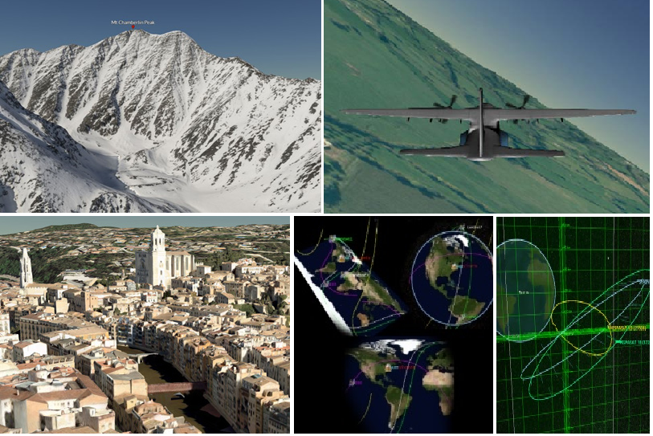

title: Cesium - web端三维地理空间可视化工具

speaker: 黄子涵
url: https://github.com/CN-3211
js:
    - https://echarts.cdn.apache.org/zh/asset/theme/infographic.js
plugins:
    - echarts: {theme: infographic}
    - mermaid: {theme: forest}
    - katex

<slide class="bg-black-blue aligncenter" image="./public/earth.jpg .dark">

# Cesium {.text-landing.text-shadow}

一款基于JavaScript语言开发的，面向web端的三维地理空间可视化工具 {.text-intro.animated.fadeInUp.delay-500}

[:fa-github: Github](https://github.com/CesiumGS/cesium){.button.ghost.animated.flipInX.delay-1200}

<slide class="bg-gradient-white">

:::column
## **:fa-users: Cesium介绍** {.animated.fadeInUp}

* ##### Cesium是什么 {.animated.fadeInUp}
* ##### 我们为什么要选择和使用Cesium {.animated.fadeInUp}
* ##### Cesium能实现哪些效果 {.animated.fadeInUp}
* ##### 如何在项目中使用Cesium {.animated.fadeInUp}

---
## **:fa-line-chart: 学习路线分享** {.animated.fadeInUp.delay-400}

* ##### 底层原理掌握 {.animated.fadeInUp.delay-400}
* ##### 业务层技术学习 {.animated.fadeInUp.delay-400}

---
## **:fa-cut: 模板缓冲切割** {.animated.fadeInUp.delay-800}

* ##### 模板缓冲的技术原理 {.animated.fadeInUp.delay-800}
* ##### 如何利用模板缓冲技术做三维地质模型切割 {.animated.fadeInUp.delay-800}
* ##### 将模板缓冲技术应用到Cesium中 {.animated.fadeInUp.delay-800}

---
## **:fa-graduation-cap: 扩展与展望** {.animated.fadeInUp.delay-1200}

* ##### 利用webGL扩展Cesium {.animated.fadeInUp.delay-1200}
* ##### Cesium与虚幻引擎 {.animated.fadeInUp.delay-1200}
:::

<slide class="aligncenter bg-primary">

# Cesium介绍

<slide class="bg@rhino">

!

# Cesium是什么？

Cesium 是一款面向三维地球和地图的，世界级的JavaScript**开源**产品

它提供了基于JavaScript语言的开发包，方便用户快速搭建一款零外挂的虚拟地球Web应用，并在性能，精度，渲染质量以及多平台，易用性上都有高质量的保证。

通俗一点来解释，从应用上来说，他就是一个**三维版**的百度地图或者高德地图；从底层的方面来说，Cesium是一个Javascript包，通过一系处理和操作来将计算机图形学和地理空间联系起来

<slide>

## 1.Cesium的知识体系

Cesium 是一个跨界SDK，涉及三个知识领域 ： Web前端、计算机图学、地理信息系统（GIS）{.text-subtitle.animated.fadeInDown.delay-800}

!

<slide>

## 2.Cesium在项目中的定位

在项目中，Cesium所承担的是B/S端三维数据可视化的角色{.text-subtitle.animated.fadeInDown.delay-800}

!

<slide>

# 我们为什么要选择和使用Cesium？

:::flexblock {.features.fadeInUp}

## :fa-lock: 开源

Cesium基于Apache2.0协议，开放源代码

---
## :fa-dollar: 免费

Cesium的使用免费，源码获取免费

---
## :fa-cog: 功能强大

Useful → Easy → Fast → Beautiful
:::

<slide :class="size-100" image="https://images.prismic.io/cesium/6285f5dd-7b3e-48cf-9716-20ff893f2796_cesium-for-unreal.jpg?auto=compress%2Cformat&fit=crop&ar=3.000&w=64%2064w,%20https://images.prismic.io/cesium/6285f5dd-7b3e-48cf-9716-20ff893f2796_cesium-for-unreal.jpg?auto=compress%2Cformat&fit=crop&ar=3.000&w=90%2090w,%20https://images.prismic.io/cesium/6285f5dd-7b3e-48cf-9716-20ff893f2796_cesium-for-unreal.jpg?auto=compress%2Cformat&fit=crop&ar=3.000&w=125%20125w,%20https://images.prismic.io/cesium/6285f5dd-7b3e-48cf-9716-20ff893f2796_cesium-for-unreal.jpg?auto=compress%2Cformat&fit=crop&ar=3.000&w=176%20176w,%20https://images.prismic.io/cesium/6285f5dd-7b3e-48cf-9716-20ff893f2796_cesium-for-unreal.jpg?auto=compress%2Cformat&fit=crop&ar=3.000&w=246%20246w,%20https://images.prismic.io/cesium/6285f5dd-7b3e-48cf-9716-20ff893f2796_cesium-for-unreal.jpg?auto=compress%2Cformat&fit=crop&ar=3.000&w=344%20344w,%20https://images.prismic.io/cesium/6285f5dd-7b3e-48cf-9716-20ff893f2796_cesium-for-unreal.jpg?auto=compress%2Cformat&fit=crop&ar=3.000&w=482%20482w,%20https://images.prismic.io/cesium/6285f5dd-7b3e-48cf-9716-20ff893f2796_cesium-for-unreal.jpg?auto=compress%2Cformat&fit=crop&ar=3.000&w=675%20675w,%20https://images.prismic.io/cesium/6285f5dd-7b3e-48cf-9716-20ff893f2796_cesium-for-unreal.jpg?auto=compress%2Cformat&fit=crop&ar=3.000&w=945%20945w,%20https://images.prismic.io/cesium/6285f5dd-7b3e-48cf-9716-20ff893f2796_cesium-for-unreal.jpg?auto=compress%2Cformat&fit=crop&ar=3.000&w=1322%201322w,%20https://images.prismic.io/cesium/6285f5dd-7b3e-48cf-9716-20ff893f2796_cesium-for-unreal.jpg?auto=compress%2Cformat&fit=crop&ar=3.000&w=1851%201851w,%20https://images.prismic.io/cesium/6285f5dd-7b3e-48cf-9716-20ff893f2796_cesium-for-unreal.jpg?auto=compress%2Cformat&fit=crop&ar=3.000&w=1920%201920w">

:::card

# Cesium能实现哪些效果

通过Cesium提供的JS API，可以实现以下功能：

* 使用3d tiles格式流加载各种不同的3d数据，包含倾斜摄影、人工模型、三维建筑物、CAD、BIM，点云数据等。 并支持样式设定和用户互动操作。 并支持样式设定和用户互动操作
* 地形、 模型3d tiles模型的面裁剪。
* 全球高精度地形数据可视化，支持夸张效果、以及可编程实现的等高线和坡度分析效果。
* 支持标准的矢量格式 CZML 、KML 、GeoJSON、TopoJSON， 以及向量的贴地效果。
* 支持各种几何体：点(聚合)、 线、面、标注、公告牌、立方球、椭球体、圆柱走廊 （corridors）、管径、墙体
* 可视化效果包括：阴影，粒子特效，大气、雾、太阳、阳光、月亮、星星、水面等。
* 三维模型支持 gltf2.0 标准的 PBR 材质、动画蒙皮和 和 变形效果。 贴地以及高亮
* 支持多种资源的影象层，包括 WMS，TMS， WMTS以及时序影象。 支持透明度叠加， 亮度、对比度、GAMMA、色调、饱和度都可以动态调整。 支持影象的卷帘对比。
---

:::

<slide class="bg-black-blue aligncenter" image="https://images.prismic.io/cesium/ff7176ed-9331-4ba4-aca0-3baa329ec6db_earth-at-night.png?auto=compress%2Cformat&rect=129%2C0%2C1662%2C1080&w=1322 .anim.dark">

## 更多功能...

如有兴趣，请前往下方链接查看官方沙盒示例中的全部展示效果!{.text-subtitle}

---

[:fa-map: Cesium](https://sandcastle.cesium.com/index.html?src=Hello%2520World.html){.button.ghost.animated.flipInX.delay-1200}

<slide>

# 如何在项目中使用Cesium

`.text-cols (2 columns)`

:::div {.text-cols}

**为何要使用Vue和Typescript？** 很多人在刚刚入门Cesium的时候，写的都是单HTML页面，这对于现如今的工程化，模块化开发来说，无疑是很不合适的。因此有必要将Cesium和Vue框架结合起来，并运用Typescript的类型检测功能编写规范且易于重构的前端代码...

**如何在Vue项目中引入Cesium？**. 具体可以参考我自己搭建的[项目](https://github.com/CN-3211/cesium-web-vue)，在commit history中有从零开始，详细的构建过程，以及我基于工作和学习的需求二次开发的Cesium功能，webGL学习内容，重写的沙盒代码等...

:::

:::flexblock {.metrics}

# Vue3.0

----

# TypeScript

----

# Cesium
:::

<slide class="aligncenter bg-primary">

# 学习路线分享

<slide>

## 底层原理掌握

:::flexblock {.blink.border}

## :fa-bar-chart: 计算机图形学

从最底层开始，学习计算机将数据转化为图形的过程和原理

---

## :fa-bar-chart: webGL

浏览器和网页是如何绘制出复杂的三维图形

---

## :fa-balance-scale: Cesium源码

了解开源工具的最好方式就是阅读他的源码

:::

---

## 业务层技术学习

:::flexblock {.blink.border}

## :fa-bar-chart: Cesium sandcastle

Cesium官方提供的功能展示页面

---

## :fa-bar-chart: 社区讨论

通过各种开放源码或者提供思路的社区学习新技术

---

## :fa-bar-chart: Cesium-web-vue项目

没有什么能比一个刚刚踩完坑的项目更能帮初学者排雷了

:::

<slide>

## 1.底层原理掌握
`最近几个月里，与业务技术相比，我接触的更多的可能还是分析学习Cesium的底层代码，因此在这里分享一下个人总结的一些相关学习经验`

:::{.content-left}

:::flexblock {.specs}

## 计算机图形学

强烈推荐bilibili上，闫令琪老师主讲的[**计算机图形学入门**](https://www.bilibili.com/video/BV1X7411F744?p=1)这一系列视频。但是不建议一次性刷完全部课程。其难度偏高，如果是初学者一次性刷完很难理解。个人认为如果要实现基本业务模块的开发，则仅需要了解P1-P4部分的课程。此时了解了一些常见的矩阵和向量概念，对业务模块的开发会很有帮助。倘若想在底层知识上继续深挖，也建议分阶段看完该视频课程，每看完一部分课程后，找到对应的webGL-Api学习和理解，相信对各位大有裨益。

---

## webGL

关于webGL的学习，我推荐阅读由谢光磊先生所译的[**《webGL编程指南》**](https://book.douban.com/subject/25909351/)一书。同时辅以郭隆邦先生所著的[**《WebGL零基础入门教程》**](http://www.yanhuangxueyuan.com/WebGL/)电子书。其中《webGL编程指南》一书是公认的初学者入门必读项，其有配套的英文官方网站已经相关源码下载，虽然出版时间距今较为久远，但是仍然具有极高的参考价值。至于后一本《WebGL零基础入门教程》电子书，在学习完编程指南一书后，通过该电子书能很好的梳理和融会贯通前面学习的内容。

最后补充一个在线网址[**一张图看懂webGL执行内幕**](https://webglfundamentals.org/webgl/lessons/resources/webgl-state-diagram.html?exampleId=rainbow-triangle#no-help)，该页面解耦并细化了利用webGL，将数据转化为图像的全部过程，并用流程图的形式动态展现出来，非常有用！

:::

:::{.content-right}

:::flexblock 

## Cesium源码阅读

前面关于计算机图形学和webGL的学习，其目的归根结底在于帮助我们去理解和分析Cesium的源码，但是对于我们来说仅仅依靠这两者是远远不够的。在这里我推荐法克鸡丝所写的博客，[**Cesium教程系列汇总原理篇**](https://www.cnblogs.com/fuckgiser/p/5706842.html)。该系列博客以浅显易懂，幽默风趣的方式对Cesium的下面四个主要模块进行了讲解...

1. **地球渲染模块**
2. **Render渲染引擎模块**
3. **Workers线程**
4. **Entity&Primitive&3D Tiles模型加载模块**

:::

---

<slide>

## 2.业务层技术学习
`由于自己对业务功能开发花费的精力的较少，仅仅说一下一些个人的看法`

:::{.content-left}

:::flexblock {.specs}

## Cesium sandcastle

经过我最近几个月的研究和学习，我得出一个结论，当前三维可视化的学习生态和学习环境并不是特别好。正如之前所说的，Cesium是基于阿帕奇2.0协议开源，因此开发者们可以在其基础上二次开发新的功能，同时二次开发的作者具有闭源并收费的权力。因此不止市面上的一些公司，如超图，火星科技等公司对其二次开发的产品进行闭源。甚至个人实现的一些功能均对源码展示进行收费，并且报价极其昂贵。

经过我的多次碰壁和消费之后，在掌握了一定的Cesium开发技术后，我得出一个结论：[**Cesium sandcastle**](https://sandcastle.cesium.com/index.html?src=Hello%2520World.html)是最好的Cesium功能学习平台。只要我们逐一掌握了他的每一项功能，自然而然的市面上“收费”的各种功能都能一一实现。我的建议是首先从头至尾看一遍Cesium sandcastle中的所有功能，做到心中有数。这一过程可能花费数小时，但是一定要有耐心。

---

## Cesium社区

关于这个没什么好说的，基本都收费，简单推荐两个性价比较高的社区分享给大家[**Cesium中文网**](http://cesium.xin/)和GIS之家所发布的[**Cesium小专栏**](https://xiaozhuanlan.com/gishome-cesium)。这两个社区内容都比较多且实用，并且收费较低...

:::

!

---

<slide :class="size-60">

## Cesium Api学习路线

`官方给出的Api文档内容极其多，为了更有效，更快速的掌握相关Api，推荐可以参考如下路线进行学习...`

* :Viewer类学习\::{.text-label} 一切API的入口
* :Camera类学习\::{.text-label} 想去哪里去哪里(Cartesian3和Cartographic)
* :Imagery Layer类学习\::{.text-label} 地球原来如此多姿(ImageryProvider类)
* :Terrain Provider类学习\::{.text-label} 这才是“真”三维(sampleTerrain)
* :Entity API\::{.text-label} 与地球交互起来(Data Source,Scene.pick、Property)
* :Primitive API\::{.text-label} 性能提升第一步(GeometryInstance类、Geometry类)
* :Fabric\::{.text-label} 玩点高级的( Appearance类, Material类)
* :ParticleSystem\::{.text-label} (Particle类, Particleemitter类)
{.description}

<slide :class="size-70">
## Cesium进阶之路 （3大方向）

:::gallery

### Web前端方向

Cesium与webpack （裁剪以及压缩），Cesium 与vue （框架设计， 嵌入复杂业务系统）， Cesium的UI （UI 设计，定制可复用的Cesium互动界面）

---

### 图形学方向

WebGL深入，基于Cesium 的视觉化定制（视阈、水淹、水面、热力图，流场图、飞线图、扫描图）等效果的实现

---

### 数据预处理方向

投影变换，空间索引，LOD ，3dtile生成，数据储存，数据分发服务，解决超大空间数据如何在 Cesium上流畅可视化的问题。

:::

<slide class="aligncenter bg-primary">

# 模板缓冲切割

<slide>

!

## 1.模板缓冲的技术原理

模板缓冲：用来做区域遮罩用的，模板缓冲区可以为屏幕上的每个像素点保存一个无符号整数值，然后将这个值进行比较来决定是否需要更新屏幕上对应像素的值。这个作比较的过程叫做**模板测试** 

模板测试：在渲染的过程中，用模板缓冲的值（Stencil Value）与一个预先设定的参考值（Ref）相比较。根据比较的结果来决定是否更新相应的像素点的颜色值。这个比较的过程被称为模板测试。

<slide class="size-60 aligncenter">

## 2.如何利用模板缓冲技术做三维地质模型切割

1. 利用clip接口对三维地质模型进行切割，具体原理可以阅读我写的这篇笔记的[**clippingPlane实现原理剖析**](https://pretty-heather-82c.notion.site/3D-Tiles-605e914b7dbd4defacf42c0c2b408d15)部分
2. 使用模板缓冲区，将模型的切面部分和非切面部分保存至模板缓冲区中。
3. 再对模型进行两遍绘制。第一遍直接绘制模型，在片元着色器中去掉剪切掉的像素，第二遍绘制切口，根据模板缓存中记录各个屏幕上的像素个数决定是否是需要封口。
4. 创建多个个平面并把它投影到切口面上覆盖住切口，利用模板缓存把平面多余的像素滤掉。

<slide>

!

## 3.将模板缓冲技术应用到Cesium中

首先，Cesium官方是不提供模板缓冲机制的，如果我们需要在Cesium中去实现基于模板缓冲的三维地质模型剖切，必然需要自己编写webGL代码和相关着色器代码，并找嵌套至对应位置进行renderloop。这一点无疑是比较麻烦且复杂的，因此受限于当前的技术水平，目前我选择采用了其他方式来实现

当前我选择的是利用threeJS实现模型剖切后，再将threeJS叠加在Cesium上，但是这样会面临两个问题：

1. 叠加时如何同步二者的renderLoop，并且如何同步控制Cesium和threeJS的视角
2. 3D tiles是Cesium特有的模型格式，如何在threeJS中顺利加载

上述两个难点均在我的[**项目代码**](https://github.com/CN-3211/cesium-web-vue/blob/master/src/views/threeJsClipObjModelStencil.vue)中有解决，有兴趣的同学可以去看看。

<slide class="aligncenter bg-primary">

# 扩展与展望

<slide :class="size-60">

## 我们还能用Cesium做什么？

---

:::shadowbox

## 利用webGL扩展Cesium

事实上，除了Cesium官方团队用Cesium所实现的一些功能，我们还能利用webGL对Cesium 的源代码进行改写，实现各种各样的炫酷效果。例如[**火星科技**](http://mars3d.cn/example#%E5%90%84%E7%A7%8D%E7%89%B9%E6%95%88)和[**supermap超图**](http://support.supermap.com.cn:8090/webgl/examples/webgl/examples.html#visualization-special-effect)两家，三维可视化方面在国内代表性比较强的公司。

---

## Cesium与虚幻引擎

Cesium for Unreal于2021-03-30正式发布，让虚幻引擎具有了Google Earth (opens new window)的能力，为模拟真实世界打开了一扇新的大门。

:::

<slide class="bg-black-blue aligncenter" image="https://cn.bing.com/az/hprichbg/rb/PragueChristmas_EN-AU8649790921_1920x1080.jpg .dark">

## THANKS FOR WATCHING **并且** 共同学习，共同进步 {.animated.tada}

下面是我的项目地址，各位有兴趣的话可以多多相互交流

[:fa-cloud-download: Github CN-3211](https://github.com/CN-3211/cesium-web-vue){.button.animated.delay-1s.fadeInUp}